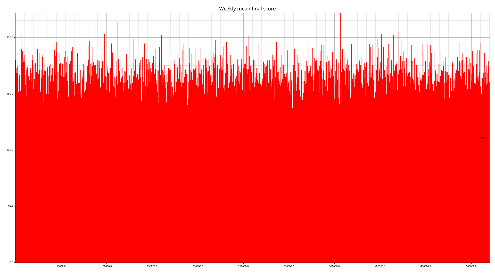
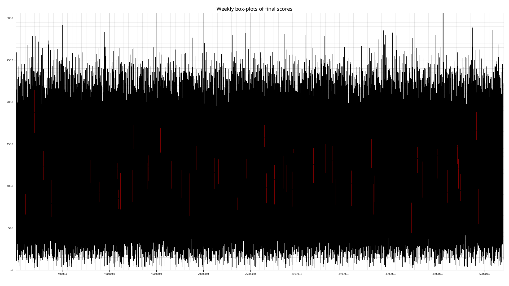
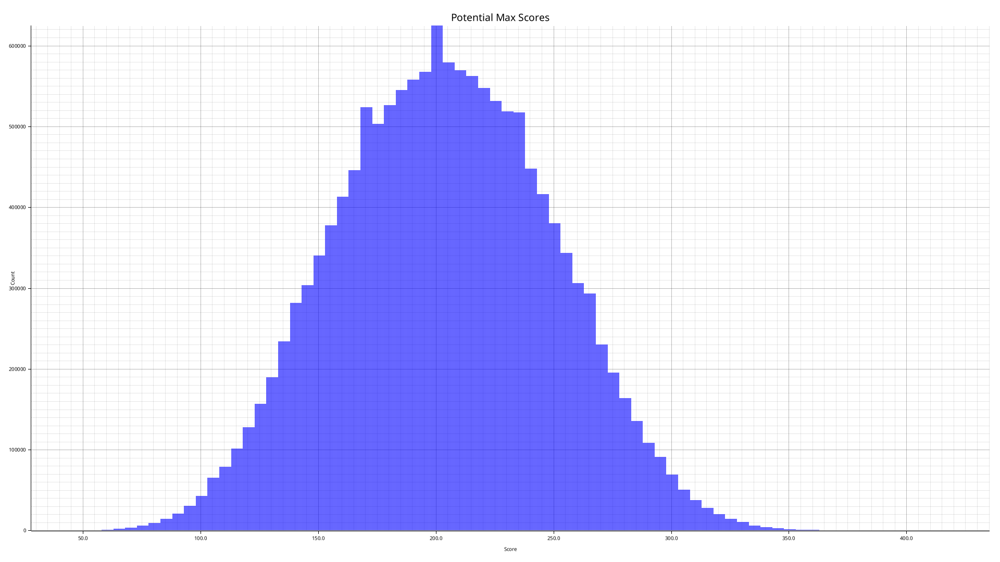
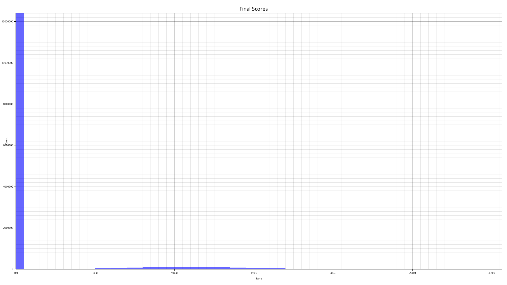

# Bingo‑Simulator – Scoring & Visualisation

This document explains the *exact* algorithm that the simulator implements
and clarifies how the four plots relate to it.

---

## 1. What the code actually does

| Step                        | Action                                                                                                                                                                                                                                                       | Rationale                                                                                                                                   |
|-----------------------------|--------------------------------------------------------------------------------------------------------------------------------------------------------------------------------------------------------------------------------------------------------------|---------------------------------------------------------------------------------------------------------------------------------------------|
| **(a) Weekly confirmation** | At the start of each week the simulator picks a random number `k` (20 ‑ 50) of *confirmed* tiles from the master list.  Those tile IDs form the “winning‑tile array” for that week.                                                                          | They are the only tiles that can help you win in any game that week.                                                                        |
| **(b) Board generation**    | For every game the simulator chooses a fresh board: it randomly samples **24 distinct tiles from the whole master list**, ignoring the confirmed set entirely.  The sampled tiles are arranged into a 5 × 5 matrix.                                          | This mimics drawing a new Bingo board for each match, independent of the winning tiles.                                                     |
| **(c) Winning‑row test**    | The simulator checks whether any full row, column or diagonal on that board consists *only* of confirmed tiles (i.e. every tile’s ID is in the weekly set).  If such a line exists we have a win; otherwise the game is lost.                                | A Bingo win occurs when you complete one of the five canonical lines.                                                                       |
| **(d) Final score**         | <br>• If a winning line was found: the simulator sums the *weighted values* (`x·y`) of **all tiles on the entire board that are also confirmed** – not just those in the winning line.<br>• If no winning line exists, the final score for that game is `0`. | The sum represents how “good” all the confirmed numbers on that board were; only boards containing a full winning line contribute anything. |
| **(e) Maximum potential**   | For every game the simulator records the *maximum* possible score for the current weight state: `max_potential = Σ (x·y)` over **all 25 tiles on the board**, irrespective of confirmation status.                                                           | Useful for normalising and comparing weeks.                                                                                                 |

> **Result** – Each game produces two numbers: <br>`final_score` – the weighted sum of all confirmed tiles on a
> winning‑board, <br>`max_potential` – the theoretical maximum score for that board.

*Weights (`y`) are updated only after an entire week has finished,
using a grow/shrink factor based on whether a tile was in the
confirmed set.*

---

## 2. Visualisation

The simulator writes four PNG files that can be shown anywhere:

| File                                                | What it shows                                                                                                                                                                                                                    |
|-----------------------------------------------------|----------------------------------------------------------------------------------------------------------------------------------------------------------------------------------------------------------------------------------|
|             | *Red line chart* – average final score of each week (X‑axis: “Week 1 … Week N”, Y‑axis: score).  Each point reflects the mean over all games in that week.                                                                       |
|              | *Box plot* – one per week.  The box shows the 25 %–75 % range of weekly scores; a line inside indicates the median; whiskers extend to the minimum and maximum values seen that week.  Gives spread and outliers for every week. |
|  | *Histogram* – counts how many times each *maximum potential* score appears in the entire data set (all weeks & games).  X‑axis: specific max‑score value; Y‑axis: frequency.                                                     |
|           | *Histogram of final scores* – same format as above, but for the actual earned scores (including zeros for lost games).                                                                                                           |

Place these Markdown lines in a page (e.g. `docs/overview.md`) and GitHub Pages will render the charts automatically.

---

## 3. Quick reference

```bash
# Run the simulation: 20 games per week, 104 weeks (= 2 years),
# using the default tiles file.
cargo run --release -- 20 104
```

After completion you will find the four PNG files in the project root.

---

## 4. Summary

- **Scoring**: for each game a fresh 5 × 5 board is generated; if any row/column/diagonal consists only of weekly
  confirmed tiles, the score equals the weighted sum of *all* confirmed tiles on that board (otherwise `0`).
- **Maximum potential**: weighted sum over all 25 tiles on the board.
- **Plots**:
    - Mean scores per week (red line).
    - Box‑plots per week (high, low, median).
    - Histograms for both potentials and final scores.